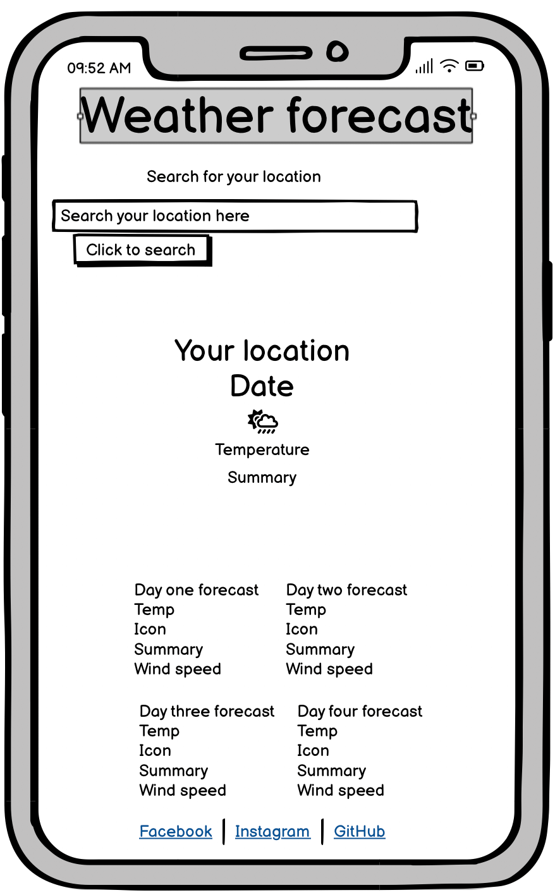
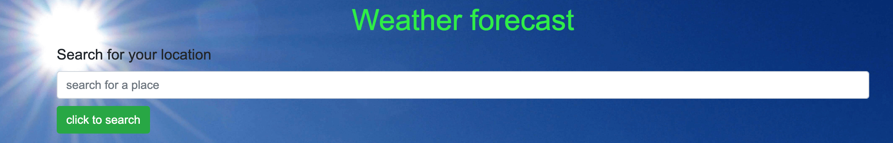

> 
> 

# Weather forecast

> [View live project here](https://helproudman.github.io/weather/)
> 
> This is a simple weather application which allows users to search for their location and displays the current day and the forecast for the subsequent four days.
---
> 

>
---

## CONTENTS

 - [User experience design (UXD)](#user-experience-design)
		 
     - user stories
 - [Creation process](#creation-process)
		 
     - [Wireframes](#wireframes)
 - [Design](#design)
		 
     - Colour scheme
		 
     - Typography
		 
     - Imagery
 - [Website features](#website-features)
 - [Tablet/mobile view](#tablet/mobile-view)
 - [Future features](#future-features)
 - [Technologies used](#technologies-used)
 - [Deployment](#deployment)
 - [Testing](#testing)
 - [Credits](#credits)
 ---
 ## USER EXPERIENCE DESIGN
 
 - **First time visitor goals**
		 
     * As a first time visitor I want to know what the aim of the site is and the information I can gain from it - the layout and appearance of the site is simple with minimal distractions from the goal. The user can easily see where to input there location and what the site will do.
		 
     * As a first time visitor I want to be able to navigate the site easily and be able to navigate it easily and obtain a forecast quickly - there is only one input box and one button on the site so navigation is easy. The forecast only shows four days in advance so there is not too much information to process.
		 
     * As a first time user I want to be able to view the site on a variety of different devices and have the content appear in a logical way
		 
- **Returning visitor goals**
		
    
    * As a returning visitor I want to be able to find my favourite locations easily - the search input area stores previously searched locations
		
    
- **Frequent visitor goals**
		
    * As a frequent visitor I want to be able to find out more information about the developer - the footer contains links to GitHub and socials
---

## CREATION PROCESS

  ### Wireframes

Mobile Wireframe

  

Tablet Wireframe

  

Desktop Wireframe

  

---

## DESIGN
  - **Typography**
    
    The Arial font was chosen as it is clear and easy to read to aid with accessibility and keep the site simple. Helvetica was chosen as a back up for the same reasons
  - **Colour scheme**
    
    The colour scheme was chosen to contrast and enhance the background image. Tthe font colour was chosen using the colour picker available on Apple mac to find the RGB values which were then put into [Contrast finder](https://app.contrast-finder.org/?lang=en) to ensure good contrast between background and text. The colour of the footer was chosen to match the colour of the background image in a similar way.
  - **Imagery**
    
    The image chosen for the background for the site was intended to draw users in and make a statement. [Pexels](https://www.pexels.com/) was used to provide the royalty-free stock image. Acknowledgements for the individual photographers are in the [credits](#credits) section.
 

 ---

## WEBSITE FEATURES

  **SEARCH FIELD**
  

  The search field appears as above on desktop and laptops.

  **MAIN VIEW**
  

  
landing page

  The landing page appears the same on all devices

 
    
  **FORECAST VIEW**
  

  
Forecast view before locations search

  Once the user has searched for a location the current day and following four day forecast is shown.

   

  **SOCIAL LINKS FEATURE**
  

  
Social links image

  The footer gives links to social sites and GitHub which are highlighted when hovered over. The colours match the overall theme of the site.

 ---

## FUTURE FEATURES
The following would be options to consider including in future versions of the website:
  - animated icons for the weather to make the site more appealing

  - more weather information for the four day forecast

  - a conversion from celsius to fahrenheit

  - clickable temperature which will do the conversion

  - a weather map

  - extra pages giving specialised weather, eg for sailing

  - a page giving details of the tides with forecasts

  - a toggle button to allow th user to toggle the background image between different weather scenes to add some fun and interactivity

## TECHNOLOGIES USED

  ### Languages used
  - HTML5

  - CSS

  - JavaScript

  ### Frameworks, libraries and programs used

   
  1. [Bootstrap 4.6](https://getbootstrap.com/docs/4.6/getting-started/introduction/)
        - Bootstrap was used to ensure the site was responsive and for styling
  2. [Balsamiq](https://balsamiq.com/wireframes/)   
        - Balsamiq was used to produce the wireframes in the design phase.
  3. [Git](https://git-scm.com/)
        - Git was used for version control
  4. [Github](https://github.com/)
        - GitHub was used to store the code and allow collaboration on the project.
  5. [Contrast Finder](https://app.contrast-finder.org/?lang=en)
        - Contrast Finder was used to check the contrast between text colour and background image
  6. [Tiny.PNG](https://tinypng.com/)
        - Tiny.PNG was used to compress images
  7. [StackEdit](https://stackedit.io/)
        - StackEdit was used to assist with the markdown in the README.md
  8. [Google Chrome Dev Tools](https://developer.chrome.com/docs/devtools)
        - Used to troubleshoot and test design ideas and styling.   
  9.  [Google Lighthouse](https://developer.chrome.com/docs/lighthouse/overview)  
        - used to test performance of the website
  10. [Favicon](https://favicon.io/#google_vignette)
        - used to generate the favicon  
  11. [W3 Schools](https://www.w3schools.com/)
        - used to look up syntax for HTML and CSS
  12. [Stack Overflow](https://stackoverflow.com/)                  
        - used for queries around coding
  13. [Perplexity](https://www.perplexity.ai/)    
        - used to provide sources to generate text for the website   
  14. [Wikipedia](https://www.wikipedia.org/)      
        - used to generate text
  15. [Open Weathermap API](https://openweathermap.org/guide)
        - used to supply the weather API
  16. [Font Awesome](https://fontawesome.com/)    
        - used for the favicon
  17. [Pexels](https://www.pexels.com/)
        - used for copyright free images
  18. [W3C HTML validator](https://validator.w3.org/)
        - used to validate the HTML
  19. [W3 Jigsaw](https://jigsaw.w3.org/css-validator/)
        - used to validate the CSS
  20. [JSHint](https://jshint.com/)
        - used to validate the JavaScrip
  21. [Rapid API guides](https://rapidapi.com/guides/)
        - used for advice on using an API
  22. [Free Code Camp](https://freecodecamp.org)   
        - for help with JavaScript concepts and syntax 
  23. [Code Academy](https://codeacademy.com)   
        - for help with JavaScript concepts and syntax  
  24. [Code explained repository on GitHub](https://github.com/CodeExplainedRepo/Weather-App-JavaScript)
        - for help setting up a weather app using an API             

 ---

## DEPLOYMENT
The site was deployed via GitHub using the following steps:
1. Log in to GitHub account
2. Go to the Settings tab of the vivalasvegas repository
3. On the left-hand sidebar, in the Code and automation section, select Pages
4. Make sure:
    - Source is set to 'Deploy from Branch'.
    - Main branch is selected.
    - Folder is set to / (root).
5. Under Branch, click Save.
6. Go back to the Code tab. Wait a few minutes for the build to finish and refresh the repository.
7. On the right-hand side, in the Environments section, click on 'github-pages'.
8. Click View deployment to see the live site    

 ---

## TESTING
  The W3C Markup Validator,  W3C CSS Validator Services and JSHint were used to validate all pages of the code to ensure there were no syntax errors.
    
  - [W3C Markup Validator](https://validator.w3.org/) - [HTML validation](readme-docs/html-validated.png)
  - [W3C Jigsaw CSS Validator](https://jigsaw.w3.org/css-validator/) - [CSS validation](readme-docs/css-validated.png)

  - [JavaScript Validator](https://jshint.com) - the JavaScript validation did not throw up and issues. The fact that the use of let and const to define variables and template literals is only available with ES6 was highlighted.

### Further Testing
  - The website was tested on Google Chrome, Safari, Firefox and Microsoft Edge and performance was good across all platforms.
  - The website was viewed on a variety of screen sizes such as Desktop, Laptop, iPad Air, iPhone8.

  Each feature was tested with the following results:

  | Feature | Test | Pass/fail |
  | ---| ---| ---|
  | Search field | modal deploys if no entry on clicking submit | Pass |
  | Search field| search button | Pass |
  | Forecast | Displays when search button clicked | Pass |
  | Social links| Facebook - hover | Pass|
  | Social links | Facebook - opens in new tab | Pass |
  | Social links | GitHub - hover | Pass |
  | Social links | GitHub - opens in new tab | Pass |
  | Social links | Instagram - hover | Pass |
  | Social links | Instagram - opens in new tab | Pass |
  

## Lighthouse scores via Chrome dev tools 

  

### Accessibility     

The site was tested via WAVE the web accessibility evaluation tool and showed some alerts for contrast between the text and the background image. The colour of the text was changed and checked via [Contrast Finder](https://app.contrast-finder.org/?lang=en) which showed excellent contrast. The font size of the text was enlarged to help with the issue however after these changes the alerts still existed when evaluated on WAVE again. 
There was not enough time to correct this issue but it will be looked at in future updates

 

### Issues/Bugs

 - The icons were coded to load using a URL updated with a variable and a template literal but were not loading initially despite showing up when the link was hardwired in and the link being checked externally. The icons were added into a folder rather than being accessed via the API website but the issue remained.
 This remained an issue for a couple of days and advice was sought from Mark Briscoe who solved the issue by changing the way in which the src attribute in the HTML element was altered. 

  - the link to the JS file was added incorrectly to begin with

  - When the favicon was added the weather icons did not display on the deployed site...the script for font awesome had been added in the wrong place.

  - no reset button/facility was added in error and this was only noticed very late in the development - code was added to correct this but I ran out of time to be able to make it work

  - the location name was displaying as typed in the search box so ususally with a lowercase first letter - a line was added to the function to correct this

## CREDITS

**Content**
  - [Kera Cudmore/readme-examples on GitHub](https://github.com/kera-cudmore/readme-examples)
   was used to help write the README.md
  - [Code Institute Sample README](https://github.com/Code-Institute-Solutions/SampleREADME)
  was used as a reference when writing the README.
  - [Code explained repository](https://github.com/CodeExplainedRepo/Weather-App-JavaScript) was used to give a tutorial for using a weather API
  - [Code Institute](https://learn.codeinstitute.net/) was used for extra reference for HTML and CSS
  - [W3 Schools](https://www.w3schools.com/) was used for reference on syntax
  - [Stack Overflow](https://stackoverflow.com/) was used for syntax and coding queries
  
**Media**
  - All images were taken from [Pexels](https://www.pexels.com/). Credit to the individual artists: Brett Sayles
  - [Amiresponsive](https://ui.dev/amiresponsive) for the responsivity mockup on the README.

  - the favicon was downloaded from [Flaticon](https://flaticon.com) with credit to the creator iconixar.

  - the weather icons were taken from [Code explained repository on GitHub](https://github.com/CodeExplainedRepo/Weather-App-JavaScript)

**Acknowledgements**
  - Amy Richardson - For providing support and resources 
  - Mark Briscoe - For providing technical knowledge and support with coding and GitHub/GitPod and a tutorial on creating a weather app using an API